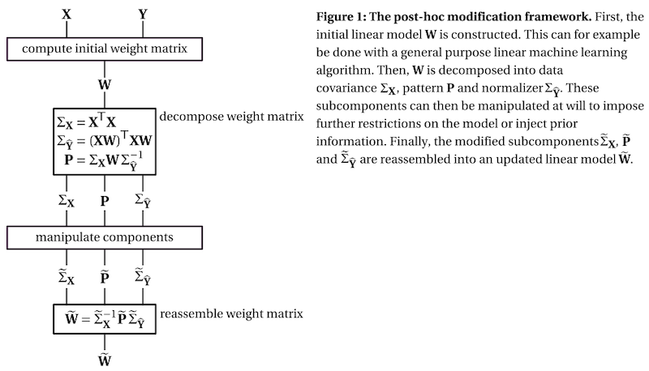

Post-Hoc Modification of Linear Models
==========

This Python package implements the post-hoc modification framework, as
presented in [van Vliet and Salmelin](https://doi.org/10.1016/j.neuroimage.2019.116221) [1].

The website for this package can be found at:
https://users.aalto.fi/~vanvlm1/posthoc/python

Background
----------

Linear machine learning models are a powerful tool that can “learn” a data
transformation by being exposed to examples of input with the desired output,
thereby forming the basis for a variety of powerful techniques for analyzing
neuroimaging data. However, their ability to learn the desired transformation
is limited by the quality and size of the example dataset, which in
neuroimaging studies is often notoriously noisy and small. In these cases, it
is desirable to fine-tune the learned linear model using domain information
beyond the example dataset. In the presence of co-linearities in the data
(which in neuroimaging is almost always the case), it is easier to formulate
domain knowledge in terms of the pattern matrix [2] than the weights. For
example, in a source estimation setting, the pattern matrix is the leadfield
(i.e., forward solution) and the weight matrix is the inverse solution.

The post-hoc adaptation framework combines the insight of Haufe et al. [2] that a
pattern matrix can be computed for any linear model, with the insight from
source estimation methods that priors that are formulated on the pattern matrix
can be translated into priors on the weight matrix.

The framework decomposes the weight matrix of a linear model into three
subcomponents:

 1. the covariance matrix of the data, which describes the scale of the input features and their relationship
 2. the pattern matrix, which describes the signal of interest, see Haufe et al. [2]
 3. the normalizer, which describes the scale of the result and the relationship between the outputs of the model



To get a better understanding of the three subcomponents, check out this
[interactive visualization](https://users.aalto.fi/~vanvlm1/posthoc/regression.html>).

Example
-------
```python
import mne
import numpy as np
from posthoc import Workbench, cov_estimators, normalizers
from sklearn.linear_model import LogisticRegressionCV
from sklearn.model_selection import cross_val_predict
from sklearn.preprocessing import normalize

# Get data (N400 priming experiment) and convert to scikit-learn's X and y
epochs = mne.read_epochs('datasets/television_commercials/avg-epo.fif')
X = normalize(epochs.get_data().reshape(len(epochs), -1))
y = (epochs.metadata.FAS > 0.1).values.astype(int)

# Evaluate base model: logistic regression
base_model = LogisticRegressionCV(cv=5)
y_pred = cross_val_predict(base_model, X, y, cv=10)
print('base model accuracy:', np.mean(y == (y_pred > 0)))

# Use post-hoc modification to add domain information about the N400
def pattern_modifier(pattern, X, y):
    """Modify the pattern by applying a Gaussian kernel in time domain."""
    center, width = 24, 15  # Shape of the kernel
    n_channels, n_samples = 32, 50  # Data dimensions
    pattern = pattern.reshape(n_channels, n_samples)
    kernel = np.exp(-0.5 * ((np.arange(n_samples) - center) / width) ** 2)
    return (pattern * kernel).ravel()

optimized_model = Workbench(
    base_model,
    cov=cov_estimators.KroneckerKernel(32, 50, alpha=0.7, beta=0.14),
    pattern_modifier=pattern_modifier,
    normalizer_modifier=normalizers.unit_gain,
)
y_pred = cross_val_predict(optimized_model, X, y, cv=10)
print('optimized model accuracy:', np.mean(y == (y_pred > 0)))
```

Installation
------------

Workbench requires a Python (either 2.7 or 3.5+) installation with the
following packages: numpy, scipy, scikit-learn, progressbar2.

You can either download this repository as a zip file here, or use the shell
command: `git clone https://github.com/wmvanvliet/posthoc.git`.

To install the workbench module, run `python setup.py install`. To verify
that everything is working correctly, you can run the test suite by running
`python -m py.test workbench/tests/*.py`.

Documentation
-------------
The paper covers the theory in depth: [Vliet and Salmelin](https://doi.org/10.1016/j.neuroimage.2019.116221>) [1].

For a gentle introduction to the concept of post-hoc modification and basic usage of the API, see this
[interactive tutorial](https://mybinder.org/v2/gh/wmvanvliet/neuroscience_tutorials/master?filepath=posthoc%2Flinear_regression.ipynb).

For quick guides on how to do specific things, see the [examples](https://users.aalto.fi/~vanvlm1/posthoc/python/auto_examples/index.html).

Finally, there is the [API reference](https://users.aalto.fi/~vanvlm1/posthoc/python/api.html) documentation.

Author of the code
------------------

Marijn van Vliet <w.m.vanvliet@gmail.com>

References
----------

1. Marijn van Vliet and Riitta Salmelin (2020). Post-hoc modification of
   linear models: combining machine learning with domain information to make
   solid inferences from noisy data. NeuroImage, 204, 116221.
   https://doi.org/10.1016/j.neuroimage.2019.116221
2. Haufe et al. (2014). On the interpretation of weight vectors of linear
   models in multivariate neuroimaging. NeuroImage, 87, 96–110.
   https://doi.org/10.1016/j.neuroimage.2013.10.067
